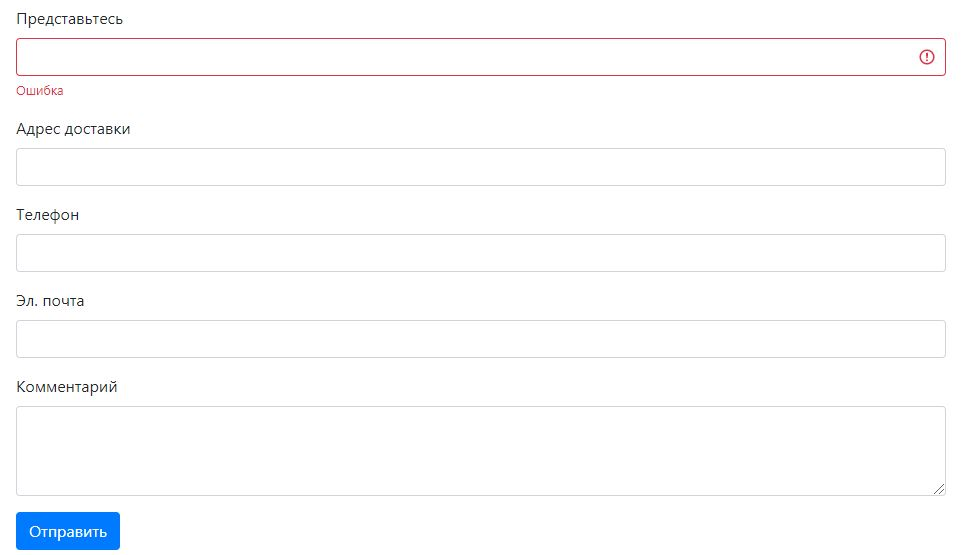
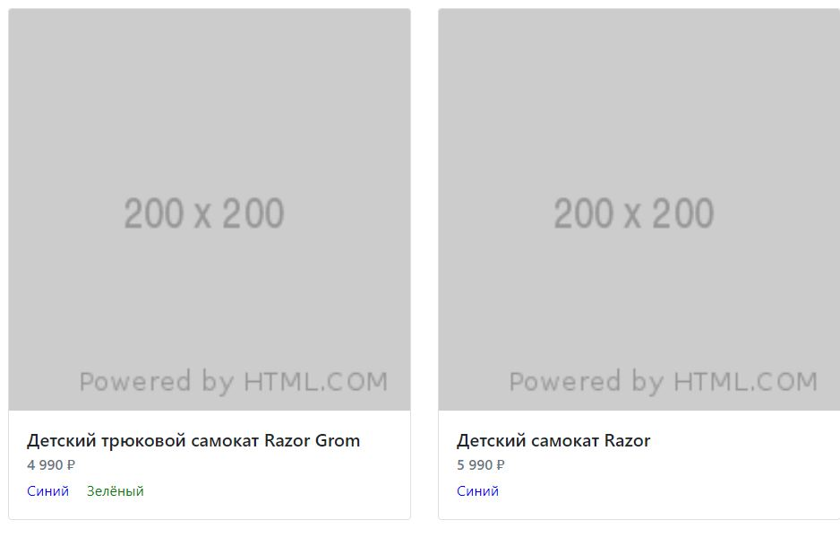

#Входное тестовое
Входное тестовое нужно, чтобы мы понимали твой уровень JavaScript и React, умение работать с REST API.

API документация: https://vue-study.skillbox.cc/
Что будет учитываться при оценке:

1. Чистота кода.
2. Компонентный подход.
3. Внимательность. Где-то в постановке и текущей реализации могут быть допущены ошибки :-)
4. Использование ES6.

##Первое задание
Нужно отправить форму Оформления заказа на сервер.

/api/orders: https://vue-study.skillbox.cc/#/Orders/post_api_orders

###Требования:
1. Сбор данных в форме должен быть реализован на React. На всякий случай уточняю :-)
2. Обработка ошибок по полям. Ошибки будут приходить в ответе, если вдруг поля невалидные.

Чтобы полностью отправить форму, нужно перед этим запросить пользовательский ключ `/api/users/accessKey`.
Форма до конца не отправиться с новым ключом, потому что тогда корзина будет пустая. Если вы дошли до этого — считайте что задание готово ;-)
Оценка менеджера
~20 минут. Если незнакомы с React — 40 минут.

##Второе задание
Нужно доделать вывод товаров. Кто-то начал задачу, а вас попросили закончить начатое.

Вывести товары нужно из категории с `id: 3`

/api/products: https://vue-study.skillbox.cc/#/Products/get_api_products

###Требования:
1. Товары должны выводиться из вычисляемого свойства `productsItems`.
2. Формат данных продукта возвращаемого `productsItems` должен соответствовать типу `Product`.

Оценка менеджера
~10 минут. Если незнакомы с React — 20 минут.

####Дополнительное задание
Зарефакторить карточку товара. Это ещё займёт 10 минут.

